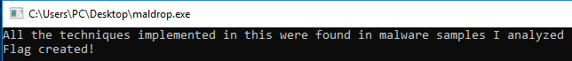
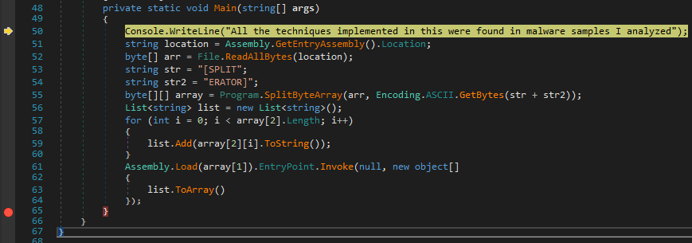
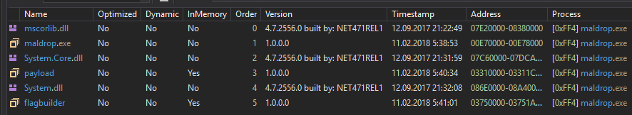
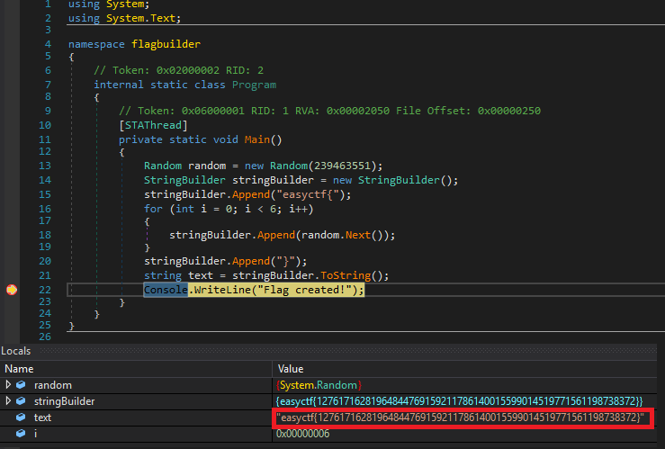

# MalDropper

**Category:** Reverse Engineering
**Points:** 160
**Solves:** ???
**Description:**

Mind looking at this malware dropper I found? 

[File](https://github.com/EasyCTF/easyctf-iv-problems/raw/master/maldropper/maldrop.exe)

Note: this isn't actually malware, it just borrows obfuscation techniques from low quality malware.

## Write-up

When we start this file we see



For this .net binary we will use [dnSpy](https://github.com/0xd4d/dnSpy)

File dynamically decrypt and run some program
```
private static void Main(string[] args)
{
	Console.WriteLine("All the techniques implemented in this were found in malware samples I analyzed");
	string location = Assembly.GetEntryAssembly().Location;
	byte[] arr = File.ReadAllBytes(location);
	string str = "[SPLIT";
	string str2 = "ERATOR]";
	byte[][] array = Program.SplitByteArray(arr, Encoding.ASCII.GetBytes(str + str2));
	List<string> list = new List<string>();
	for (int i = 0; i < array[2].Length; i++)
	{
		list.Add(array[2][i].ToString());
	}
	Assembly.Load(array[1]).EntryPoint.Invoke(null, new object[]
	{
		list.ToArray()
	});
}
```

After some analysis I set breakpoint at end of main func



and in "Modules" tab(Debug->Windows->Modules to enable) I seen



I switch to payload and it dynamically decrypt and run some program again -_-
```
private static void Main(string[] args)
{
	List<byte> list = new List<byte>();
	for (int i = 0; i < args.Length; i++)
	{
		list.Add(byte.Parse(args[i]));
	}
	MemoryStream stream = new MemoryStream(list.ToArray());
	GZipStream gzipStream = new GZipStream(stream, CompressionMode.Decompress);
	byte[] array = new byte[256];
	List<byte> list2 = new List<byte>();
	int num;
	do
	{
		num = gzipStream.Read(array, 0, 256);
		list2.AddRange(array.Take(num));
	}
	while (num != 0);
	Assembly.Load(list2.ToArray()).EntryPoint.Invoke(null, null);
}
```

Then I switch to flagbuilder(pretty name :D)
```
private static void Main()
{
	Random random = new Random(239463551);
	StringBuilder stringBuilder = new StringBuilder();
	stringBuilder.Append("easyctf{");
	for (int i = 0; i < 6; i++)
	{
		stringBuilder.Append(random.Next());
	}
	stringBuilder.Append("}");
	string text = stringBuilder.ToString();
	Console.WriteLine("Flag created!");
}
```



Flag is: easyctf{12761716281964844769159211786140015599014519771561198738372}
