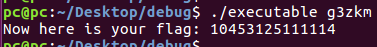

# ez_rev

**Category:** Reverse Engineering
**Points:** 140
**Solves:** ???
**Description:**

Take a look at [executable](executable). Objdump the executable and read some assembly!

## Write-up

I'm a bad boy, and I don't use Objdump, only IDA :D

So we have:
```C
void main(int argc, const char **argv, const char **envp)
{
  unsigned int flag[5]; // [rsp+10h] [rbp-20h]
  const char *flag_a; // [rsp+28h] [rbp-8h]

  signal(2, sigintHandler);
  target = *argv;
  if ( argc == 2 )
  {
    flag_a = argv[1];
    flag[0] = 1;
    flag[1] = 2;
    flag[2] = 3;
    flag[3] = 4;
    flag[4] = 5;
    flag[0] = *flag_a + 1;
    flag[1] = flag_a[1] + 2;
    flag[2] = flag_a[2] + 3;
    flag[3] = flag_a[3] + 4;
    flag[4] = flag_a[4] + 5;
    if ( flag[3] != 0x6F || flag[2] != 0x7D || flag[0] != flag[4] - 10 || flag[1] != 0x35 || flag[4] != flag[3] + 3 )
    {
      sleep(2u);
      remove(*argv);
      puts("successfully deleted!");
    }
    else
    {
      printf("Now here is your flag: ", sigintHandler, argv);
      print_flag(flag);
    }
  }
}
```

After simplify
```
(x3 + 4) == 0x6F
(x2 + 3) == 0x7D
(x0 + 1) == (x4 + 5) - 10
(x1 + 2) == 0x35
(x4 + 5) == (x3 + 4) + 3
```

We can solve these simple equations in the mind, on a piece of paper or... that would add a little fan to this boring task - z3 script :D

```Python
from z3 import *

x0, x1, x2, x3, x4 = Ints('x0 x1 x2 x3 x4')

s = Solver()

s.add( (x3 + 4) == 0x6F )
s.add( (x2 + 3) == 0x7D )
s.add( (x0 + 1) == (x4 + 5) - 10 )
s.add( (x1 + 2) == 0x35 )
s.add( (x4 + 5) == (x3 + 4) + 3 )

while s.check() == sat:
  r = s.model()
  _x0, _x1, _x2, _x3, _x4 = r[x0].as_long(), r[x1].as_long(), r[x2].as_long(), r[x3].as_long(), r[x4].as_long()
  print chr(_x0) + chr(_x1) + chr(_x2) + chr(_x3) + chr(_x4)
  s.add(_x0 != x0)
```

and answer is `g3zkm`



Flag is: **easyctf{10453125111114}**
