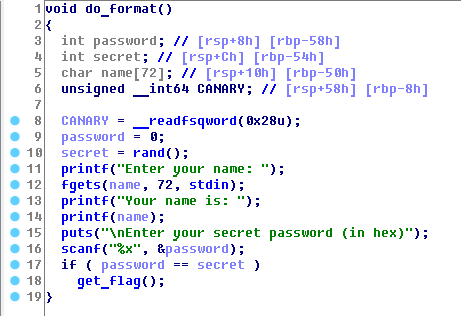
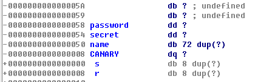
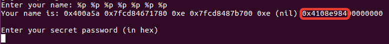
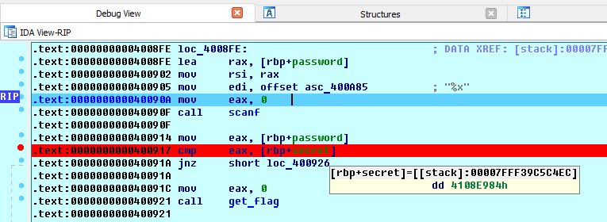

# format

**Category:** Binary Exploitation
**Points:** 120
**Solves:** 374
**Description:**

Go to `/problems/format` on the shell server and tell me what is in `flag.txt`.

[File](format)

## Write-up

By trial and error, we found that we need enter %p 7 times.

Flag is: **easyctf{p3sky_f0rm4t_s7uff}**
