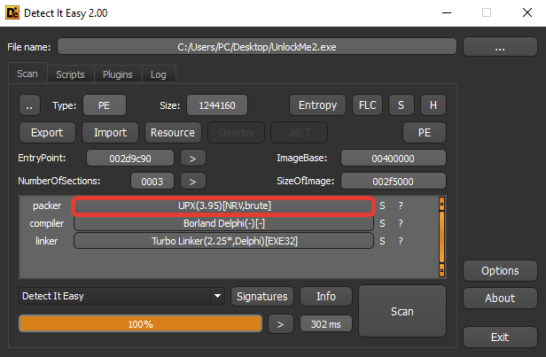
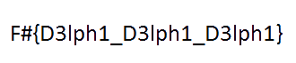

# UnlockMe

**Category:** REVERSING
**Points:** 487
**Solves:** 7
**Description:**

Find the correct key and get the prize!

[UnlockMe.zip](UnlockMe.zip)

## Write-up

First we load the binary into DIE and seen that the binary is UPX-packed:



So unpack it

```
PS D:\!CTF\FireShell_CTF_2019> upx -d UnlockMe.exe
                       Ultimate Packer for eXecutables
                          Copyright (C) 1996 - 2017
UPX 3.94        Markus Oberhumer, Laszlo Molnar & John Reiser   May 12th 2017

        File size         Ratio      Format      Name
   --------------------   ------   -----------   -----------
   2887168 <-   1244160   43.09%    win32/pe     UnlockMe.exe

Unpacked 1 file.
```

After this we have clear Delphi binary. IDA automatically determine your main function:

```C
.text:005F0AE0 _TFrmMain_Button1Click proc near        ; DATA XREF: .text:005F093E↑o
```

```C
void TFrmMain_Button1Click(my_s *arg_1)
{
  // ..

  TControl_GetText(arg_1->TFrmMain_K1_TEdit, &text_1_ptr);
  if ( text_1_ptr )
    text_1_ptr = *(text_1_ptr - 4);
  if ( text_1_ptr == 5 )                        // check len 1
  {
    TControl_GetText(arg_1->TFrmMain_K2_TEdit, &text_2_ptr);
    if ( text_2_ptr )
      text_2_ptr = *(text_2_ptr - 4);
    if ( text_2_ptr == 5 )                      // check len 2
    {
      TControl_GetText(arg_1->TFrmMain_K3_TEdit, &text_3_ptr);
      if ( text_3_ptr )
        text_3_ptr = *(text_3_ptr - 4);
      if ( text_3_ptr == 5 )                    // check len 3
      {
        TControl_GetText(arg_1->TFrmMain_K4_TEdit, &text_4_ptr);
        if ( text_4_ptr )
          text_4_ptr = *(text_4_ptr - 4);
        if ( text_4_ptr == 5 )                  // check len 4
        {
          TControl_GetText(arg_1->TFrmMain_K5_TEdit, &text_5_ptr);
          if ( text_5_ptr )
            text_5_ptr = *(text_5_ptr - 4);
          if ( text_5_ptr == 5 )                // check len 5
          {
            TControl_GetText(arg_1->TFrmMain_K1_TEdit, &text_1_ptr_2);
            TControl_GetText(arg_1->TFrmMain_K2_TEdit, &text_2_ptr_2);
            TControl_GetText(arg_1->TFrmMain_K3_TEdit, &text_3_ptr_2);
            TControl_GetText(arg_1->TFrmMain_K4_TEdit, &text_4_ptr_2);
            TControl_GetText(arg_1->TFrmMain_K5_TEdit, &text_5_ptr_2);
            UStrCatN(&MY_PASS, 5, v6, text_5_ptr_2);
            TMemoryStream = TObject(TMemoryStream, 1, v7);
            TResourceStream = TControlScrollBar__bctr(TResourceStream, 1, hInstance, &dword_5F0E2C, 10);
            TPngImage = TCustomStringsValuesList(TPngImage, 1, v9);
            TStream_SetPosition(TResourceStream, v10, v11, 0, 0);
            TStream_SetPosition(TMemoryStream, v12, v13, 0, 0);
            v14 = TResourceStream->TResourceStream->anonymous_0();
            if ( v14 - 1 >= 0 )
            {
              LEN = v14;
              COU = 0;
              do
              {
                TResourceStream->TResourceStream->Read(TResourceStream, &v37 + 3, 1);
                pass_len = *(MY_PASS - 1);
                HIBYTE(v37) ^= MY_PASS[COU % pass_len];
                TMemoryStream->TMemoryStream->Write(TMemoryStream, &v37 + 3, 1);
                ++COU;
                --LEN;
              }
              while ( LEN );
            }
            TStream_SetPosition(TMemoryStream, v15, v16, 0, 0);
            (TPngImage->TPngImage->LoadFromStream)(TPngImage, TMemoryStream);
            (*(**(arg_1->TPicture + 456) + 8))(*(arg_1->TPicture + 456), TPngImage);// TPicture.Assign
            show_hide_forms(arg_1);
            System::TObject::Free(TMemoryStream);
            System::TObject::Free(TResourceStream);
          }
          else
            // FAIL
        }
        else
          // FAIL
      }
      else
        // FAIL
    }
    else
      // FAIL
  }
  else
    // FAIL
  UStrArrayClr(&text_5_ptr_2, 10);
  UStrClr(&MY_PASS);
}
```

Messy code, but if in brief: we get 5 keys with len 5, then concatenate in one string-key `MY_PASS`, then xor-decode some binary blob with this key:

```C
  v37 ^= MY_PASS[COU % pass_len];
```

And try to show decoded file as PNG image:

```C
  (TPngImage->TPngImage->LoadFromStream)(TPngImage, TMemoryStream);
  TPicture.Assign(*(arg_1->TPicture), TPngImage);
  show_hide_forms(arg_1);
```

How to decode [encoded binary?](encoded.bin). We'll use known plaintext attack. I'm wrote small rust script to brute image height and width(all other bytes are known to us):

```Rust
fn main() {
    let mut keys = vec![];

    for height in 0..=500 {
        for width in 0..=500 {
            // first 25 bytes of PNG header
            let known = [
                0x89,
                0x50,
                0x4E,
                0x47,
                0x0D,
                0x0A,
                0x1A,
                0x0A,
                0x00,
                0x00,
                0x00,
                0x0D,
                0x49,
                0x48,
                0x44,
                0x52,
                // height as big endian dword
                0x00,
                0x00,
                (height >> 8) as u8,
                (height & 0xFF) as u8,
                // width as big endian dword
                0x00,
                0x00,
                (width >> 8) as u8,
                (width & 0xFF) as u8,
                //
                0x08_u8,
            ];

            // first 25 crypted bytes
            let crypted = [
                0xCA, 0x04, 0x0D, 0x11, 0x5A, 0x53, 0x52, 0x53, 0x50, 0x39, 0x46, 0x3F, 0x11, 0x7C,
                0x1D, 0x6A, 0x4D, 0x51, 0x43, 0x1C, 0x36, 0x56, 0x4B, 0x70, 0x4C_u8,
            ];

            let mut key = vec![];

            // try to decrypt
            for i in 0..known.len() {
                key.push(known[i] ^ crypted[i]);
            }

            // and check out key for all printable chars
            let mut fail = false;
            for i in &key {
                if *i < 0x20 || *i > 0x7E {
                    fail = true;
                    break;
                }
            }

            if fail {
                continue;
            }

            // we found printable key!
            let mut out = String::new();
            for i in 0..key.len() {
                out.push(key[i] as char);
            }

            keys.push(out);
        }
    }

    println!("{:?}", keys);
}
```

And python script to decode binary and check image:

```python
from PIL import Image

img_cou = 0

keys = # output from rust script

for key in keys:
    c = open('encoded.bin', 'rb').read()

    o = ""
    for i in range(len(c)):
        o += chr(ord(c[i]) ^ ord(key[i % len(key)]))

    open('decoded/file_%d.png' % img_cou, 'wb').write(o)
    img_cou += 1

fail_cou = 0
for i in range(img_cou):
    try:
        im = Image.open('decoded/file_%d.png' % i)
        print "NORNAL IMAGE:", i
    except IOError:
        fail_cou += 1

print fail_cou, len(keys)
```

Run script:

```
PS D:\!CTF\FireShell_CTF_2019> python decode_and_check.py
NORNAL IMAGE: 26100
36099 36100
```

Open file_26100.png :D



Flag is: **F#{D3lph1_D3lph1_D3lph1}**
