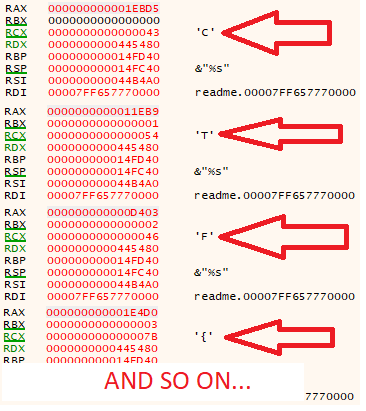

# Read Me

**Category:** Reverse Engineering
**Points:** 450
**Solves:** 16
**Description:**

Rick created this twisted program that will only work if you enter the right two numbers.

Remember to return from function and use nops to fill in any gaps.

EDIT: There were multiple of possible answers so I changed the flag format.

flag{uppercase hex values of the 5 bytes nessecery to win the flag}

[ReadMe.exe](ReadMe.exe)

## Write-up

We have small c++ 64bit windows binary, load it in disassembler.

In `main` function we have prety easy code:
```C
int __cdecl main(int argc, const char **argv, const char **envp)
{
  __int64 cou; // rbx
  HANDLE fp; // rdi
  char *buff; // rsi
  int idx; // eax
  DWORD NumberOfBytesRead; // [rsp+40h] [rbp-C0h]
  char str[15]; // [rsp+48h] [rbp-B8h]
  char user_input[40]; // [rsp+58h] [rbp-A8h]
  __int16 Filename[260]; // [rsp+80h] [rbp-80h]

  if ( IsDebuggerPresent() )                    // antidebug
    return -1;
  if ( GetTickCount() - g_tick_count > 10000 )  // antidebug
    return -1;
  GetModuleFileNameW(0i64, Filename, 260u);
  if ( GetTickCount() - g_tick_count > 10000 )  // antidebug
    return -1;
  cou = 0i64;
  fp = CreateFileW(Filename, GENERIC_READ, 1u, 0i64, 3u, 0, 0i64);
  if ( GetTickCount() - g_tick_count > 10000 )  // antidebug
    return -1;
  NumberOfBytesRead = GetFileSize(fp, 0i64);
  if ( GetTickCount() - g_tick_count > 10000 )  // antidebug
    return -1;
  buff = malloc(NumberOfBytesRead);
  ReadFile(fp, buff, NumberOfBytesRead, &NumberOfBytesRead, 0i64);// read file
  if ( GetTickCount() - g_tick_count <= 10000 ) // antidebug
  {
    scanf_s("%s", user_input, 32i64);
    while ( GetTickCount() - g_tick_count <= 10000 )// antidebug
    {
      switch ( *(cou + 0x14001FE90i64) )        // .rdata:000000014001FE90                 db '+--+-++--+-+-++--++-++*+-+-+-+',0
      {
        case '*':
          idx = g_idx * g_table[cou];
          break;
        case '+':
          idx = g_table[cou] + g_idx;
          break;
        case '-':
          idx = g_idx - g_table[cou];
          break;
        default:
          return -1;
      }
      g_idx = idx;
      if ( user_input[cou] != buff[idx] )       // compare user_input char to some other char
      {
        strcpy(str, "Wrong Bitches!");
        printf("%s", str);                      // fail
        return -1;
      }
      if ( ++cou >= 30 )
      {
        printf("%s", user_input);               // print flag
        return 0;
      }
    }
  }
  return -1;
}
```

Program read user input and then compare it to sove values.

Ok, main idea of solving is patch antidebug and get all values of `buff[idx]` at
```C
      if ( user_input[cou] != buff[idx] )
```
because user_input don't change and just compared like by `strcmp`.

We will patch:
```C
original code
->
patched code

.text:000000014000112A 74 0A                          jz      short loc_140001136
->
.text:000000014000112A EB 0A                          jmp     short loc_140001136

.text:0000000140001147 77 E3                          ja      short loc_14000112C
->
.text:0000000140001147 90                             nop
.text:0000000140001148 90                             nop

.text:000000014000116C 77 BE                          ja      short loc_14000112C
->
.text:000000014000116C 90                             nop
.text:000000014000116D 90                             nop

.text:000000014000122D 0F 87 E1 00 00+                ja      loc_140001314
->
.text:000000014000122D 90                             nop
.text:000000014000122E 90                             nop
.text:000000014000122F 90                             nop
.text:0000000140001230 90                             nop
.text:0000000140001231 90                             nop
.text:0000000140001232 90                             nop

.text:0000000140001262 0F 87 AC 00 00+                ja      loc_140001314
->
.text:0000000140001262 90                             nop
.text:0000000140001263 90                             nop
.text:0000000140001264 90                             nop
.text:0000000140001265 90                             nop
.text:0000000140001266 90                             nop
.text:0000000140001267 90                             nop

.text:000000014000127D 0F 85 91 00 00+                jnz     loc_140001314
->
.text:000000014000127D 90                             nop
.text:000000014000127E 90                             nop
.text:000000014000127F 90                             nop
.text:0000000140001280 90                             nop
.text:0000000140001281 90                             nop
.text:0000000140001282 90                             nop

.text:00000001400012BF 75 1E                          jnz     short loc_1400012DF
->
.text:00000001400012BF 90                             nop
.text:00000001400012C0 90                             nop
```

Now antidebug defeated)))

And we can just enter any password and easy collect all values of `cl` at `0x1400012BB` 

```C
.text:00000001400012B7 0F B6 0C 30                    movzx   ecx, byte ptr [rax+rsi]
.text:00000001400012BB 38 4C 1C 58                    cmp     [rsp+rbx+2A0h+user_input], cl     ; <<< HERE
```

Set breakpoint at `0x1400012BB`, load in debugger and get flag byte by byte.



Flag is: **CTF{M!sT3r_M3ese3k5_L00k_@_ME}**
