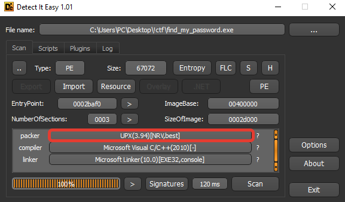
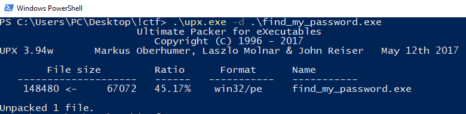
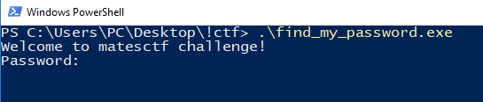
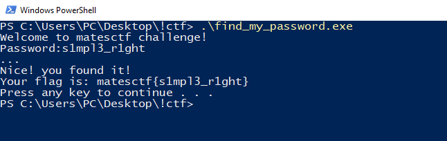

# Началось лето, закончилась школа - `наступило время для игор! :D`
Недавно был `Viettel Mates CTF 2018` в котором из-за лени я не учавствовал, но решил посмотреть несколько тасков.

Мне понравился `Find my password`, таск с категории реверс:
```
I have set a very strong password. Can you find it ?

[Binary here](https://drive.google.com/open?id=1RioCBfPAR-THYyuVMAgXzRx3UAXyStZf)
```

Итак, приступим!

## Первичный анализ

Первым делом закинем файлик в DIE(Detect It Easy) - он нам говорит что это 32битный PE бинарь, накрытый UPX’ом.



Пробуем расспаковать самим же юпыхом `upx -d find_my_password.exe` и всё прекрасно расспаковывается.



Пробуем запустить расспакованый файл - получаем креш. Загружаем в отладчик: ага, ASLR, [отключаем его](https://will.io/blog/2013/05/31/disable-aslr/), всё работает - у нас запрашивают пароль, двигаемся дальше.



Загружаем в ваш любимый дизассемблер(radare2, cutter, IDA, binary ninja - а я буду юзать иду), после анализа видим что у нас что-то смахивающее на ВМ.

Так оно и есть! После анализа и восстановления структур(в чём нам помогли [HexRaysPyTools](https://github.com/igogo-x86/HexRaysPyTools) и [HexRaysCodeXplorer](https://github.com/REhints/HexRaysCodeXplorer)) видно, что у нашей ВМ 4 однобайтовые регистры, 255 байт памяти ВМ, 172 байта пикода(0x0423488-0x0423533):
```C
struct vm_ctx
{
    char vm_memory_255[255]; // память vm
    char password[255];      // буфер для пароля
    short gap_2_1FE;         // gap, не юзается нигде
    int pcode_size;          // размер пикода
    char *pcode;             // указатель на пикод
    char REGS[4];            // массив с регистрами
    int _EIP;                // указатель на место в пикоде
    int mem_idx;             // указатель на место в памяти ВМ
    enum STATUS_E VM_STATUS; // используется для текущего состояния исполнения инструкции ВМ
};

enum STATUS_E
{
    VM_NO_OPCODE = 0x1,        // нет такого опкода, ВМ останавливается
    VM_REG_IDX_OVERFLOW = 0x2, // индекс регистра большеравно чем 4, ВМ останавливается
    VM_CONTINUE = 0x3,         // всё ок, переходим к следующей инструкции
    VM_MAX_EIP = 0x4,          // конец пикода, ВМ останавливается
    VM_WIN = 0x5,              // или мы победили, или проиграли, ВМ останавливается
};
```
и главная функция по адресу 0x0417C40 с 14 хендлерами, которая немного обфусцирована.

За счёт обфускации ида не может сделать функцию, что бы можно было б декомпильнуть код, и сократить время анализа. Но ведь для нас это не проблема ;)

Вкратце ВМ работает так: инициализируется сама ВМ - регистры, память, указатели, счетчики, потом инициализируетя пикод, считывается пароль, копируется в память виртуалки, дальше основной цикл ВМ(в котором поштучно исполняются инструкции), и если после него `vm_ctx->password[21] = 1;` значит мы победили.

Тоже самое, только кодом, а не словами :D
```C
void wmain(void)
{
    enum VM_STATUS_E error; // ST0C_4
    bool win_byte;          // al MAPDST
    int *stdout;            // eax MAPDST
    char password[20];      // [esp+0h] [ebp-238h]
    vm_ctx vm_ctx;          // [esp+18h] [ebp-220h]

    write(&g_stdout, "Welcome to matesctf challenge!\n");
    f_init_vm(&vm_ctx);
    if (f_init_pcode(&vm_ctx, g_pcode, 172))
    {
        write(&g_stdout, "Password:");
        memset(password, 0, 0x14u);
        read(&g_stdin, password);
        f_init_pass_in_vm(&vm_ctx, password);
        if (f_vm_main(&vm_ctx) == 1)
        {
            write(&g_stdout, "...\n");
            win_byte = f_ret_win_byte(&vm_ctx);
            if (win_byte == TRUE)
            {
                write(&g_stdout, "Nice! you found it!\n");
                stdout = write(&g_stdout, "Your flag is: matesctf{");
                stdout = write(stdout, password);
                write(stdout, "}\n");
            }
            else
            {
                write(&g_stdout, "No sorry. It's wrong.\n");
            }
            system("pause");
        }
        else
        {
            error = f_ret_error(&vm_ctx);
            write(&g_stdout, "...Err Code:");
            f_write_error(error);
        }
    }
    else
    {
        write(&g_stdout, "Failed to load VM code! ;)\n");
    }
}

bool __thiscall f_init_vm(vm_ctx *vm_ctx)
{
    signed int i; // [esp+4h] [ebp-4h]

    for (i = 0; i <= 4; ++i)
        vm_ctx->REGS[i] = 0;
    vm_ctx->_EIP = 0;
    vm_ctx->mem_idx = 10;
    vm_ctx->pcode_size = 0;
    vm_ctx->pcode = 0;
    memset(vm_ctx->password, 0, 0xFFu);
    return TRUE;
}

bool __thiscall f_init_pcode(vm_ctx *vm_ctx, char *pcode, signed int pcode_size)
{
    if (pcode_size > 255)
        return FALSE;
    vm_ctx->pcode = pcode;
    vm_ctx->pcode_size = pcode_size;
    return TRUE;
}

bool __thiscall f_init_pass_in_vm(vm_ctx *vm_ctx, char *password)
{
    _f_init_pass_in_vm(vm_ctx, password, 0, 0x14u);
    return TRUE;
}

bool __thiscall _f_init_pass_in_vm(vm_ctx *vm_ctx, char *password, char idx_zero, size_t size)
{
    memcpy(&vm_ctx->password[idx_zero], password, size);
    return TRUE;
}

bool __thiscall f_vm_main(vm_ctx *vm_ctx)
{
    for (vm_ctx->VM_STATUS = VM_CONTINUE; vm_ctx->VM_STATUS == VM_CONTINUE; vm_ctx->VM_STATUS = VM_MAIN(vm_ctx))
        ;
    return vm_ctx->VM_STATUS == VM_WIN;
}

bool __thiscall f_ret_win_byte(vm_ctx *this)
{
    bool win_byte; // [esp+7h] [ebp-1h]

    _f_ret_win_byte(this, &win_byte, 21, 1u);
    return win_byte;
}

bool __thiscall _f_ret_win_byte(vm_ctx *vm_ctx, void *dst, bool idx_21, size_t size)
{
    memcpy(dst, &vm_ctx->password[idx_21], size);
    return TRUE;
}

enum VM_STATUS_E __thiscall f_ret_error(vm_ctx *vm_ctx)
{
    return vm_ctx->VM_STATUS;
}
```

Теперь чуть более интересно - деобфускация VM_MAIN и разбор хендлеров.

## Деобфускация

Обфускация у нас простенькая, несколько opaque predicate, да несколько мелких трюков вроде такого:
```x86asm
.text:004181F9                 js      short loc_4181FF               ; хотя бы один из этих jmp'ов всегда выполнится
.text:004181FB                 jns     short loc_4181FF               ; ибо получается условие типа `if (false || true) then jmp`
.text:004181FD                 jmp     short near ptr loc_41820A+1
```
```x86asm
.text:00417C9B                 push    eax                            ; push -> pop == nop
.text:00417C9C                 jz      short fake_pop_eax             ; opaque predicate, part1
.text:00417C9E                 pop     eax                            ; push -> pop == nop
.text:00417C9F                 jnz     short real_code                ; opaque predicate, part2
.text:00417CA1                 pusha                                  ; сюда мы не попадаем никогда
.text:00417CA2                 movsb
.text:00417CA3                 mov     dl, 0FCh
.text:00417CA5                 mov     eax, 0F63780DDh
.text:00417CA5 ; ---------------------------------------------------------------------------
.text:00417CAA                 db 67h, 1Ch
.text:00417CAC ; ---------------------------------------------------------------------------
.text:00417CAC
.text:00417CAC fake_pop_eax:
.text:00417CAC                 pop     eax                            ; push -> pop == nop
.text:00417CAD
.text:00417CAD real_code:
.text:00417CAD                 movsx   eax, byte ptr [ebp-3]          ; реальный код
```
```x86asm 
.text:00418272                 push    eax
.text:00418273                 call    inc_ret_addr                   ; тоже самое что и jmp 0x0418279
.text:00418278                 push    ecx                            ; по этому этот код никогда не исполнится
.text:00418279                 js      short fake_pop_then_real_code  ; opaque predicate, part1
.text:0041827B                 mov     eax, 0CC316234h                ; мусор, за счёт push eax -> pop eax
.text:00418280                 jns     short fake_pop_then_real_code  ; opaque predicate, part2
.text:00418280 ; ---------------------------------------------------------------------------
.text:00418282                 db 0DCh
.text:00418283 ; ---------------------------------------------------------------------------
.text:00418283
.text:00418283 inc_ret_addr:
.text:00418283                 pop     eax
.text:00418284                 inc     eax
.text:00418285                 push    eax
.text:00418286                 retn
.text:00418286 ; ---------------------------------------------------------------------------
.text:00418287                 db 0DCh
.text:00418288 ; ---------------------------------------------------------------------------
.text:00418288
.text:00418288 fake_pop_then_real_code:
.text:00418288                                                        ; .text:00418280↑j
.text:00418288                 pop     eax                            ; push -> pop == nop
.text:00418289                 movsx   ecx, byte ptr [ebp-3]          ; реальный код
```

Сколько раз сталкиваюсь с такой простенькой обфускацией на ЦТФ'ах - всё никак не придумаю как автоматизировать деобфускацию, иногда прокатывает [optimice](https://code.google.com/archive/p/optimice/)(не работает в иде 7.x), иногда только ручкам.

Тут будем комбинировать эти способы - для этого воспользуемся патчером для иды - [keypatch](https://github.com/keystone-engine/keypatch) для нопа мусорных инструкций, а потом optimice для оптимизации функции и её CFG(уберёт лишние nop'ы и jmp'ы, за счёт чего будет красивый граф функции).

## Разбор хендлеров

И так, обфускацию убрали, всё лишнее занопили, можем декомпильнуть функцию в иде - разбираем хендлеры. У нас их как уже было сказано - 14 штук.
Декомпиль выдаёт нам такой код:
```C
STATUS_E __thiscall VM_MAIN(vm_ctx *vm_ctx)
{
    STATUS_E result; // eax
    char byte_0;     // ST19_1
    char byte_1;     // ST19_1 MAPDST
    char *pcode;     // [esp+14h] [ebp-8h]
    char REG_1;      // [esp+19h] [ebp-3h] MAPDST
    char REG_2;      // [esp+1Bh] [ebp-1h] MAPDST

    if (vm_ctx->_EIP >= vm_ctx->pcode_size)
        return 4;
    pcode = vm_ctx->pcode;
    byte_0 = pcode[vm_ctx->_EIP++];
    switch (byte_0)
    {
    case 0:
        byte_1 = pcode[vm_ctx->_EIP++];
        vm_ctx->vm_memory_255[++vm_ctx->mem_idx] = byte_1;
        goto ret_CONTINUE;

    case 1:
        REG_1 = pcode[vm_ctx->_EIP++];
        if (REG_1 > 4)
            return VM_REG_IDX_OVERFLOW;
        vm_ctx->vm_memory_255[++vm_ctx->mem_idx] = vm_ctx->REGS[REG_1];
        goto ret_CONTINUE;

    case 2:
        REG_1 = pcode[vm_ctx->_EIP++];
        if (REG_1 > 4)
            return VM_REG_IDX_OVERFLOW;
        vm_ctx->REGS[REG_1] = vm_ctx->vm_memory_255[vm_ctx->mem_idx--];
        goto ret_CONTINUE;

    case 3:
        REG_1 = pcode[vm_ctx->_EIP++];
        REG_2 = pcode[vm_ctx->_EIP++];
        if (REG_1 > 4 || REG_2 > 4)
            return VM_REG_IDX_OVERFLOW;
        vm_ctx->REGS[REG_1] = vm_ctx->REGS[REG_2];
        goto ret_CONTINUE;

    case 4:
        REG_1 = pcode[vm_ctx->_EIP++];
        if (REG_1 > 4)
            return VM_REG_IDX_OVERFLOW;
        byte_1 = pcode[vm_ctx->_EIP++];
        vm_ctx->REGS[REG_1] = byte_1;
        goto ret_CONTINUE;

    case 5:
        REG_1 = pcode[vm_ctx->_EIP++];
        if (REG_1 > 4)
            return VM_REG_IDX_OVERFLOW;
        byte_1 = pcode[vm_ctx->_EIP++];
        vm_ctx->REGS[REG_1] = vm_ctx->password[byte_1];
        goto ret_CONTINUE;

    case 6:
        REG_1 = pcode[vm_ctx->_EIP++];
        REG_2 = pcode[vm_ctx->_EIP++];
        if (REG_2 > 4)
            return VM_REG_IDX_OVERFLOW;
        vm_ctx->password[REG_1] = vm_ctx->REGS[REG_2];
        goto ret_CONTINUE;

    case 7:
        REG_1 = pcode[vm_ctx->_EIP++];
        if (REG_1 > 4)
            return VM_REG_IDX_OVERFLOW;
        byte_1 = pcode[vm_ctx->_EIP++];
        vm_ctx->REGS[REG_1] -= byte_1;
        goto ret_CONTINUE;

    case 8:
        REG_1 = pcode[vm_ctx->_EIP++];
        if (REG_1 > 4)
            return VM_REG_IDX_OVERFLOW;
        byte_1 = pcode[vm_ctx->_EIP++];
        vm_ctx->REGS[REG_1] += byte_1;
        goto ret_CONTINUE;

    case 9:
        ++vm_ctx->_EIP;
        goto ret_CONTINUE;

    case 10:
        REG_1 = pcode[vm_ctx->_EIP++];
        REG_2 = pcode[vm_ctx->_EIP++];
        byte_1 = pcode[vm_ctx->_EIP++];
        if (REG_1 > 4 || REG_2 > 4)
            return VM_REG_IDX_OVERFLOW;
        if (vm_ctx->REGS[REG_1] == vm_ctx->REGS[REG_2])
            vm_ctx->_EIP += byte_1;
        goto ret_CONTINUE;

    case 11:
        byte_1 = pcode[vm_ctx->_EIP++];
        vm_ctx->_EIP += byte_1;
        goto ret_CONTINUE;

    case 12:
        ++vm_ctx->_EIP;
        return VM_WIN;

    case 13:
        REG_1 = pcode[vm_ctx->_EIP++];
        if (REG_1 <= 4)
        {
            byte_1 = pcode[vm_ctx->_EIP++];
            vm_ctx->REGS[REG_1] ^= byte_1;
        ret_CONTINUE:
            result = VM_CONTINUE;
        }
        else
        {
            result = VM_REG_IDX_OVERFLOW;
        }
        break;

    default:
        return VM_NO_OPCODE;
    }
    return result;
}
```

Хорошо читаемый и легкопонятный код, и вместо такого
```x86asm
.text:0041838C                    HANDLERS_TABLE  dd offset loc_417CC8    ; jump table for switch statement
.text:0041838C                                    dd offset loc_417D1B
.text:0041838C                                    dd offset loc_417D8C
.text:0041838C                                    dd offset loc_417DFD
.text:0041838C                                    dd offset loc_417E88
.text:0041838C                                    dd offset loc_417F11
.text:0041838C                                    dd offset loc_417F93
.text:0041838C                                    dd offset loc_418015
.text:0041838C                                    dd offset loc_41809E
.text:0041838C                                    dd offset loc_418127
.text:0041838C                                    dd offset loc_418141
.text:0041838C                                    dd offset loc_41824B
.text:0041838C                                    dd offset loc_4182A4
.text:0041838C                                    dd offset loc_4182C3
```

После разбора получаем такое :)

Где MEM - байт из памяти вм, BYTE - байт из пикода, REG - регистр, PASS - байт из пароля.
```x86asm
.text:0041838C                    HANDLERS_TABLE  dd offset MOV_MEM_BYTE  ; jump table for switch statement
.text:0041838C                                    dd offset MOV_MEM_REG
.text:0041838C                                    dd offset MOV_REG_MEM
.text:0041838C                                    dd offset MOV_REG_REG
.text:0041838C                                    dd offset MOV_REG_BYTE
.text:0041838C                                    dd offset MOV_REG_PASS
.text:0041838C                                    dd offset MOV_PASS_REG
.text:0041838C                                    dd offset SUB_REG_BYTE
.text:0041838C                                    dd offset ADD_REG_BYTE
.text:0041838C                                    dd offset NOP
.text:0041838C                                    dd offset JMP_IF_REGa_EQ_REGb
.text:0041838C                                    dd offset JMP_EIP_plus_BYTE
.text:0041838C                                    dd offset WIN
.text:0041838C                                    dd offset XOR_REG_BYTE
```

Теперь уже хотя бы немного можно себе представить что происходит в ВМ.

## Пишем дизассемблер пикода на Rust
ЦТФ давно закончился, времени у нас много, по этому я решил попрактиковаться в новом для меня(месяц на нём) и очень крутом языке - Rust.

Переписываем код VM_MAIN на Rust и попутно добавляя дизассемблирование инструкций и чуть отсебятины(можно запустить на https://play.rust-lang.org):
```rust
use std::io;

fn main() {
    println!("Welcome to matesctf challenge!\n(Reversed and rewritten from C++ to Rust by Kosbeg)");

    let mut need_disasm = true;
    let mut disasm_as_pseudocode = true;

    println!("Do you want to disasm execution trace? Yes by default. (y\\n)");
    let mut flg = "".to_string();

    match io::stdin().read_line(&mut flg) {
        Ok(_ok) => {
            flg = flg.trim().to_string();
            flg = if flg.is_empty() { "y".to_string() } else { flg }
        }
        Err(_err) => flg = "y".to_string(),
    }

    let byte = flg.as_bytes()[0];
    if byte == b'n' || byte == b'N' {
        need_disasm = false;
    } else {
        println!("Do you want to disasm as pseudocode? Yes by default. (y\\n)");

        let mut flg = "".to_string();

        match io::stdin().read_line(&mut flg) {
            Ok(_ok) => {
                flg = flg.trim().to_string();
                flg = if flg.is_empty() { "y".to_string() } else { flg }
            }
            Err(_err) => flg = "y".to_string(),
        }

        let byte = flg.as_bytes()[0];
        if byte == b'n' || byte == b'N' {
            disasm_as_pseudocode = false;
        }
    }

    let pcode = vec![
        0x00, 0x10, 0x02, 0x00, 0x05, 0x01, 0x00, 0x0D, 0x01, 0x63, 0x0A, 0x00, 0x01, 0x01, 0x0C,
        0x05, 0x00, 0x01, 0x08, 0x00, 0x45, 0x07, 0x00, 0x09, 0x05, 0x01, 0x02, 0x0A, 0x00, 0x01,
        0x01, 0x0C, 0x01, 0x00, 0x05, 0x00, 0x03, 0x0B, 0x03, 0x00, 0x03, 0x08, 0x08, 0x00, 0x07,
        0x0D, 0x00, 0x1B, 0x05, 0x01, 0x04, 0x0A, 0x00, 0x01, 0x01, 0x0C, 0x0D, 0x01, 0x5F, 0x05,
        0x02, 0x05, 0x0A, 0x01, 0x02, 0x01, 0x0C, 0x08, 0x02, 0x2C, 0x05, 0x03, 0x06, 0x0A, 0x02,
        0x03, 0x01, 0x0C, 0x0D, 0x03, 0x2D, 0x05, 0x02, 0x07, 0x0A, 0x02, 0x03, 0x01, 0x0C, 0x07,
        0x02, 0x41, 0x05, 0x01, 0x08, 0x0A, 0x01, 0x02, 0x01, 0x0C, 0x08, 0x01, 0x36, 0x05, 0x00,
        0x09, 0x0A, 0x00, 0x01, 0x01, 0x0C, 0x08, 0x00, 0x01, 0x05, 0x01, 0x0A, 0x0A, 0x00, 0x01,
        0x01, 0x0C, 0x0D, 0x01, 0x1C, 0x05, 0x00, 0x0B, 0x0A, 0x00, 0x01, 0x01, 0x0C, 0x0D, 0x00,
        0x74, 0x05, 0x01, 0x0C, 0x0A, 0x00, 0x01, 0x01, 0x0C, 0x04, 0x03, 0x00, 0x0A, 0x03, 0x01,
        0x01, 0x0C, 0x02, 0x03, 0x08, 0x03, 0x06, 0x05, 0x02, 0x00, 0x0A, 0x03, 0x02, 0x01, 0x0C,
        0x04, 0x00, 0x01, 0x06, 0x15, 0x00, 0x0C,
    ]; // pcode: .data:00423488..=0x0423533

    let mut password: [u8; 255] = [0; 255]; // password and IS_WIN_BYTE(pass[21]) buffer

    println!("Password:");
    let mut password_s = "".to_string();
    io::stdin().read_line(&mut password_s).unwrap();
    password_s = password_s.trim().to_string(); // read password from user

    password[..password_s.len()].clone_from_slice(&password_s.as_bytes()[..password_s.len()]); // copy password to buffer

    // println!("{:?}", password.to_vec()); // debug

    println!();

    let mut vm_memory_255: [u8; 255] = [0; 255]; // vm_memory
    let mut memory_idx: u8 = 10;
    let mut regs: [u8; 4] = [0; 4]; // registers array

    let mut eip: u8 = 0; // pcode index
    let (mut byte_0, mut byte_1, mut reg_1, mut reg_2, mut last_eip): (u8, u8, u8, u8, u8); // tmp variables

    let mut mnem_str = "".to_string(); // mnemonic string

    let mut need_break: bool = false;
    let mut flag_is_eq: bool = false;

    loop {
        last_eip = eip;
        byte_0 = pcode[eip as usize];
        eip += 1;

        match OPCODE::from_u8(byte_0) {
            MOV_MEM_BYTE => {
                byte_1 = pcode[eip as usize];
                eip += 1;
                memory_idx += 1;
                vm_memory_255[memory_idx as usize] = byte_1;

                if disasm_as_pseudocode {
                    mnem_str = format!("memory[{}] = {}", memory_idx, byte_1);
                } else {
                    mnem_str = format!("mov memory[{}], {}", memory_idx, byte_1);
                }
            }

            MOV_MEM_REG => {
                reg_1 = pcode[eip as usize];
                eip += 1;
                memory_idx += 1;
                vm_memory_255[memory_idx as usize] = regs[reg_1 as usize];

                if disasm_as_pseudocode {
                    mnem_str = format!(
                        "memory[{}] = REG{}\t\t; REG{1} = {}",
                        memory_idx, reg_1, regs[reg_1 as usize]
                    );
                } else {
                    mnem_str = format!(
                        "mov memory[{}], REG{}\t\t; REG{1} = {}",
                        memory_idx, reg_1, regs[reg_1 as usize]
                    );
                }
            }

            MOV_REG_MEM => {
                reg_1 = pcode[eip as usize];
                eip += 1;
                regs[reg_1 as usize] = vm_memory_255[memory_idx as usize];
                memory_idx -= 1;

                if disasm_as_pseudocode {
                    mnem_str = format!(
                        "REG{} = memory[{}]\t\t; memory[{1}] = {}",
                        reg_1,
                        memory_idx + 1,
                        regs[reg_1 as usize]
                    );
                } else {
                    mnem_str = format!(
                        "mov REG{}, memory[{}]\t\t; memory[{1}] = {}",
                        reg_1,
                        memory_idx + 1,
                        regs[reg_1 as usize]
                    );
                }
            }

            MOV_REG_REG => {
                reg_1 = pcode[eip as usize];
                eip += 1;

                reg_2 = pcode[eip as usize];
                eip += 1;

                regs[reg_1 as usize] = regs[reg_2 as usize];

                if disasm_as_pseudocode {
                    mnem_str = format!(
                        "REG{} = REG{}\t\t; REG{1} = {}",
                        reg_1, reg_2, regs[reg_2 as usize]
                    );
                } else {
                    mnem_str = format!(
                        "mov REG{}, REG{}\t\t; REG{1} = {}",
                        reg_1, reg_2, regs[reg_2 as usize]
                    );
                }
            }

            MOV_REG_BYTE => {
                reg_1 = pcode[eip as usize];
                eip += 1;

                byte_1 = pcode[eip as usize];
                eip += 1;

                regs[reg_1 as usize] = byte_1;

                if disasm_as_pseudocode {
                    mnem_str = format!("REG{} = {}", reg_1, byte_1);
                } else {
                    mnem_str = format!("mov REG{}, {}", reg_1, byte_1);
                }
            }

            MOV_REG_PASS => {
                reg_1 = pcode[eip as usize];
                eip += 1;

                byte_1 = pcode[eip as usize];
                eip += 1;

                regs[reg_1 as usize] = password[byte_1 as usize];

                if disasm_as_pseudocode {
                    mnem_str = format!(
                        "REG{} = PASS[{}]\t\t\t; PASS[{1}] = {}",
                        reg_1, byte_1, password[byte_1 as usize]
                    );
                } else {
                    mnem_str = format!(
                        "mov REG{}, PASS[{}]\t\t; PASS[{1}] = {}",
                        reg_1, byte_1, password[byte_1 as usize]
                    );
                }
            }

            MOV_PASS_REG => {
                byte_1 = pcode[eip as usize];
                eip += 1;

                reg_1 = pcode[eip as usize];
                eip += 1;

                password[byte_1 as usize] = regs[reg_1 as usize];

                if disasm_as_pseudocode {
                    mnem_str = format!(
                        "PASS[{}] = REG{}\t\t\t; REG{1} = {}",
                        byte_1, reg_1, regs[reg_1 as usize]
                    );
                } else {
                    mnem_str = format!(
                        "mov PASS[{}], REG{}\t\t; REG{1} = {}",
                        byte_1, reg_1, regs[reg_1 as usize]
                    );
                }
            }

            SUB_REG_BYTE => {
                reg_1 = pcode[eip as usize];
                eip += 1;

                byte_1 = pcode[eip as usize];
                eip += 1;

                regs[reg_1 as usize] -= byte_1;

                if disasm_as_pseudocode {
                    mnem_str = format!(
                        "REG{} -= {}\t\t\t; REG{0} = {} - {} = {}",
                        reg_1,
                        byte_1,
                        regs[reg_1 as usize] + byte_1,
                        byte_1,
                        regs[reg_1 as usize]
                    );
                } else {
                    mnem_str = format!(
                        "sub REG{}, {}\t\t\t; REG{0} = {} - {} = {}",
                        reg_1,
                        byte_1,
                        regs[reg_1 as usize] + byte_1,
                        byte_1,
                        regs[reg_1 as usize]
                    );
                }
            }

            ADD_REG_BYTE => {
                reg_1 = pcode[eip as usize];
                eip += 1;

                byte_1 = pcode[eip as usize];
                eip += 1;

                regs[reg_1 as usize] += byte_1;

                if disasm_as_pseudocode {
                    mnem_str = format!(
                        "REG{} += {}\t\t\t; REG{0} = {} + {} = {}",
                        reg_1,
                        byte_1,
                        regs[reg_1 as usize] - byte_1,
                        byte_1,
                        regs[reg_1 as usize]
                    );
                } else {
                    mnem_str = format!(
                        "add REG{}, {}\t\t\t; REG{0} = {} + {} = {}",
                        reg_1,
                        byte_1,
                        regs[reg_1 as usize] - byte_1,
                        byte_1,
                        regs[reg_1 as usize]
                    );
                }
            }

            NOP => {
                eip += 1;

                mnem_str = "NOP".to_string();
            }

            JMP_IF_REGa_EQ_REGb => {
                reg_1 = pcode[eip as usize];
                eip += 1;

                reg_2 = pcode[eip as usize];
                eip += 1;

                byte_1 = pcode[eip as usize];
                eip += 1;

                let mut is_taken = "not taken".to_string();
                flag_is_eq = false;
                if regs[reg_1 as usize] == regs[reg_2 as usize] {
                    flag_is_eq = true;
                    is_taken = "taken".to_string();
                }
                eip += byte_1; // do jump always, our main goal is disassembling

                mnem_str = format!(
                    "if REG{} == REG{}: eip += {}\t; {} == {}\t\t; {}\n",
                    reg_1, reg_2, byte_1, regs[reg_1 as usize], regs[reg_2 as usize], is_taken
                );
            }

            JMP_EIP_plus_BYTE => {
                byte_1 = pcode[eip as usize];
                eip += 1;
                eip += byte_1;

                mnem_str = format!("JMP: eip += {}", byte_1);
            }

            WIN => {
                eip += 1;
                need_break = true;
            }

            XOR_REG_BYTE => {
                reg_1 = pcode[eip as usize];
                eip += 1;

                byte_1 = pcode[eip as usize];
                eip += 1;

                regs[reg_1 as usize] ^= byte_1;

                if disasm_as_pseudocode {
                    mnem_str = format!(
                        "REG{} ^= {}\t\t\t; REG{0} = {} ^ {} = {}",
                        reg_1,
                        byte_1,
                        regs[reg_1 as usize] ^ byte_1,
                        byte_1,
                        regs[reg_1 as usize]
                    );
                } else {
                    mnem_str = format!(
                        "xor REG{}, {}\t\t\t; REG{0} = {} ^ {} = {}",
                        reg_1,
                        byte_1,
                        regs[reg_1 as usize] ^ byte_1,
                        byte_1,
                        regs[reg_1 as usize]
                    );
                }
            }
        }

        if need_break || eip + 1 > pcode.len() as u8 {
            break;
        }

        if need_disasm {
            let bytes;
            bytes = &pcode[(last_eip as usize)..(eip as usize)];

            let mut bytes_str: String = "".to_string();
            for byte in bytes {
                bytes_str = format!("{} {:02X}", bytes_str, byte);
            }
            while bytes_str.len() < 40 {
                bytes_str = format!("{} ", bytes_str);
            }

            print!("{}", bytes_str.trim_left());
            println!("{}", mnem_str);
        }
    }

    if flag_is_eq {
        println!(
            "\n\nNice! you found it! Your flag is: matesctf{{{}}}",
            password_s
        );
    } else {
        println!("\nNo sorry. It's wrong.");
    }
}

use OPCODE::*;

#[allow(non_camel_case_types)]
enum OPCODE {
    MOV_MEM_BYTE = 0x00,
    MOV_MEM_REG = 0x01,
    MOV_REG_MEM = 0x02,
    MOV_REG_REG = 0x03,
    MOV_REG_BYTE = 0x04,
    MOV_REG_PASS = 0x05,
    MOV_PASS_REG = 0x06,
    SUB_REG_BYTE = 0x07,
    ADD_REG_BYTE = 0x08,
    NOP = 0x09,
    JMP_IF_REGa_EQ_REGb = 0x0A,
    JMP_EIP_plus_BYTE = 0x0B,
    WIN = 0x0C,
    XOR_REG_BYTE = 0x0D,
}

impl OPCODE {
    fn from_u8(value: u8) -> OPCODE {
        match value {
            0 => MOV_MEM_BYTE,
            1 => MOV_MEM_REG,
            2 => MOV_REG_MEM,
            3 => MOV_REG_REG,
            4 => MOV_REG_BYTE,
            5 => MOV_REG_PASS,
            6 => MOV_PASS_REG,
            7 => SUB_REG_BYTE,
            8 => ADD_REG_BYTE,
            9 => NOP,
            10 => JMP_IF_REGa_EQ_REGb,
            11 => JMP_EIP_plus_BYTE,
            12 => WIN,
            13 => XOR_REG_BYTE,

            _ => panic!("Unknown value: {}", value),
        }
    }
}
```

## Разбор листинга и трасы ВМ

Получаем такое - траса ВМ с попутным исполнением пикода и обязательно исполненые условные переходы(если не прыгать - то мы попадаем на байт 0xC, что останавливает ВМ, и говорит что мы проиграли, а так как у нас не дизасм и он не рекурсивный, а у нас скорее эмулятор, то приходится прыгать):

```
00 10                                  memory[11] = 16
02 00                                  REG0 = memory[11]                ; memory[11] = 16
05 01 00                               REG1 = PASS[0]                   ; PASS[0] = 0
0D 01 63                               REG1 ^= 99                       ; REG1 = 0 ^ 99 = 99
0A 00 01 01 0C                         if REG0 == REG1: eip += 1        ; 16 == 99              ; not taken

05 00 01                               REG0 = PASS[1]                   ; PASS[1] = 0
08 00 45                               REG0 += 69                       ; REG0 = 0 + 69 = 69
07 00 09                               REG0 -= 9                        ; REG0 = 69 - 9 = 60
05 01 02                               REG1 = PASS[2]                   ; PASS[2] = 0
0A 00 01 01 0C                         if REG0 == REG1: eip += 1        ; 60 == 0               ; not taken

01 00                                  memory[11] = REG0                ; REG0 = 60
05 00 03                               REG0 = PASS[3]                   ; PASS[3] = 0
0B 03 00 03 08                         JMP: eip += 3
08 00 07                               REG0 += 7                        ; REG0 = 0 + 7 = 7
0D 00 1B                               REG0 ^= 27                       ; REG0 = 7 ^ 27 = 28
05 01 04                               REG1 = PASS[4]                   ; PASS[4] = 0
0A 00 01 01 0C                         if REG0 == REG1: eip += 1        ; 28 == 0               ; not taken

0D 01 5F                               REG1 ^= 95                       ; REG1 = 0 ^ 95 = 95
05 02 05                               REG2 = PASS[5]                   ; PASS[5] = 0
0A 01 02 01 0C                         if REG1 == REG2: eip += 1        ; 95 == 0               ; not taken

08 02 2C                               REG2 += 44                       ; REG2 = 0 + 44 = 44
05 03 06                               REG3 = PASS[6]                   ; PASS[6] = 0
0A 02 03 01 0C                         if REG2 == REG3: eip += 1        ; 44 == 0               ; not taken

0D 03 2D                               REG3 ^= 45                       ; REG3 = 0 ^ 45 = 45
05 02 07                               REG2 = PASS[7]                   ; PASS[7] = 0
0A 02 03 01 0C                         if REG2 == REG3: eip += 1        ; 0 == 45               ; not taken

07 02 41                               REG2 -= 65                       ; REG2 = 0 - 65 = 191
05 01 08                               REG1 = PASS[8]                   ; PASS[8] = 0
0A 01 02 01 0C                         if REG1 == REG2: eip += 1        ; 0 == 191              ; not taken

08 01 36                               REG1 += 54                       ; REG1 = 0 + 54 = 54
05 00 09                               REG0 = PASS[9]                   ; PASS[9] = 0
0A 00 01 01 0C                         if REG0 == REG1: eip += 1        ; 0 == 54               ; not taken

08 00 01                               REG0 += 1                        ; REG0 = 0 + 1 = 1
05 01 0A                               REG1 = PASS[10]                  ; PASS[10] = 0
0A 00 01 01 0C                         if REG0 == REG1: eip += 1        ; 1 == 0                ; not taken

0D 01 1C                               REG1 ^= 28                       ; REG1 = 0 ^ 28 = 28
05 00 0B                               REG0 = PASS[11]                  ; PASS[11] = 0
0A 00 01 01 0C                         if REG0 == REG1: eip += 1        ; 0 == 28               ; not taken

0D 00 74                               REG0 ^= 116                      ; REG0 = 0 ^ 116 = 116
05 01 0C                               REG1 = PASS[12]                  ; PASS[12] = 0
0A 00 01 01 0C                         if REG0 == REG1: eip += 1        ; 116 == 0              ; not taken

04 03 00                               REG3 = 0
0A 03 01 01 0C                         if REG3 == REG1: eip += 1        ; 0 == 0                ; taken

02 03                                  REG3 = memory[11]                ; memory[11] = 60
08 03 06                               REG3 += 6                        ; REG3 = 60 + 6 = 66
05 02 00                               REG2 = PASS[0]                   ; PASS[0] = 0
0A 03 02 01 0C                         if REG3 == REG2: eip += 1        ; 66 == 0               ; not taken

04 00 01                               REG0 = 1
06 15 00                               PASS[21] = REG0                  ; REG0 = 1
```

После изучения дизасма мы можем заметить такие уравнения(а можем и не заметить `¯\_(ツ)_/¯`):

```
PASS[0] ^ 99 == 16
PASS[1] + 60 == PASS[2]
(PASS[3] + 7) ^ 27 == PASS[4]
PASS[4] ^ 95 == PASS[5]
PASS[5] + 44 == PASS[6]
PASS[6] ^ 45 == PASS[7]
PASS[7] - 65 == PASS[8]
PASS[8] + 54 == PASS[9]
PASS[9] + 1 == PASS[10]
PASS[10] ^ 28 == PASS[11]
PASS[11] ^ 116 == PASS[12]
PASS[1] + 66 == PASS[0]
```

Пихаем их в какой нибудь SMT solver(например тут я заюзал Z3, а можно заюзать самописный в 75 строчек, точнее не самописный, а переписаный с C++ на Rust `¯\_(ツ)_/¯`) и получаем:

```python
from z3 import *
s = Solver()

x0, x1, x2, x3, x4, x5, x6, x7, x8, x9, x10, x11, x12 = BitVecs("x0 x1 x2 x3 x4 x5 x6 x7 x8 x9 x10 x11 x12", 8)

s.add( x0 >= 0x20, x0 < 0x7f, x1 >= 0x20, x1 < 0x7f, x2 >= 0x20, x2 < 0x7f, x3 >= 0x20, x3 < 0x7f )
s.add( x4 >= 0x20, x4 < 0x7f, x5 >= 0x20, x5 < 0x7f, x6 >= 0x20, x6 < 0x7f, x7 >= 0x20, x7 < 0x7f )
s.add( x8 >= 0x20, x8 < 0x7f, x9 >= 0x20, x9 < 0x7f, x10 >= 0x20, x10 < 0x7f, x11 >= 0x20, x11 < 0x7f )
s.add( x12 == 0 ) # printable ASCII range

s.add( x0 ^ 99 == 16 )
s.add( x1 + 60 == x2 )
s.add( (x3 + 7) ^ 27 == x4 )
s.add( x4 ^ 95 == x5 )
s.add( x5 + 44 == x6 )
s.add( x6 ^ 45 == x7 )
s.add( x7 - 65 == x8 )
s.add( x8 + 54 == x9 )
s.add( x9 + 1 == x10 )
s.add( x10 ^ 28 == x11 )
s.add( x11 ^ 116 == x12 )
s.add( x1 + 66 == x0 )

while s.check() == sat:
  r = s.model() # result
  _x0, _x1, _x2, _x3, _x4 = r[x0].as_long(), r[x1].as_long(), r[x2].as_long(), r[x3].as_long(), r[x4].as_long()
  _x5, _x6, _x7, _x8, _x9 = r[x5].as_long(), r[x6].as_long(), r[x7].as_long(), r[x8].as_long(), r[x9].as_long()
  _x10, _x11, _x12 = r[x10].as_long(), r[x11].as_long(), r[x12].as_long()
 
  print chr(_x0) + chr(_x1) + chr(_x2) + chr(_x3) + chr(_x4) + chr(_x5) + chr(_x6) + chr(_x7) + chr(_x8) + chr(_x9) + chr(_x10) + chr(_x11) + chr(_x12)

  s.add(Or( x0 != _x0, x1 != _x1, x2 != _x2, x3 != _x3, x4 != _x4, x5 != _x5, x6 != _x6, x7 != _x7, x8 != _x8, x9 != _x9, x10 != _x10, x11 != _x11, x12 != _x12 )) # anticollision
```
```sh
PS C:\Users\PC\Desktop> python sol.py
s1mpl3_r1ght
```

Пробуем вводить этот пароль:



Bот и всё - прога довольная и мы тоже, мы победили простенькую ВМ с простенькой обфускацией)
